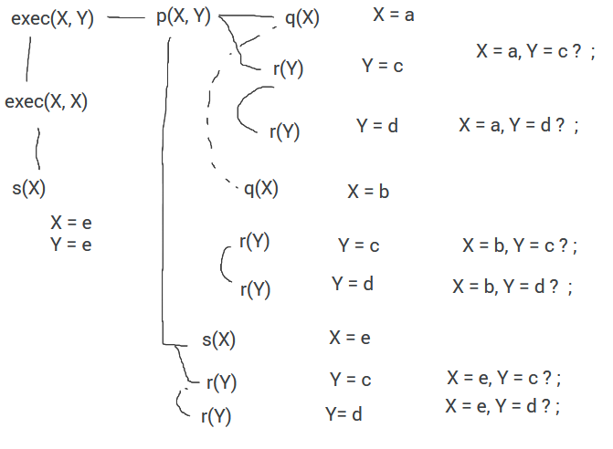

exec(x, y) passa a ser p(x, y)

p(x, y) é verdadeiro se q(x) e r(y)

Testa se q(x) é verdadeiro. Depois prossegue para r(y)
Se q(x) não for verdadeiro, ignora r(y)

q(a) é verdeira, x = a

Agora tentar provar r(Y)
r(c) é verdadeira, pelo que y = c

Se não quisermos esta solução, vai ser feito backtracking 
A última coisa a ser encontrada foi r(c). Logo esta vai ser ignorada e a proxima solução válida é r(d).
Logo x = a, y = d.

Não sendo valida novamente é executada novamente, tentando encontrar um novo valor para o y.
Não existe mais nenhum valor válido para o y.
Deste modo vamos fazer backtracking para encontrar um novo x.

q(b) é válido. Encontramos o r(c), que também é válido
Logo x = b, y = c.

Fazendo backtrack novamente, ignoramos y = c, pelo que y = d.
Logo x = b, y = d.

Tentando fazer backtracking novamente, podemos ver que dá para provar p(x,y) 
provando s(X) e r(Y)

Depois, fazer novamente este passos até não existir mais soluções.

Finalmente exec(X, Y) tentando mostrar que s(X) é verdadeira.

